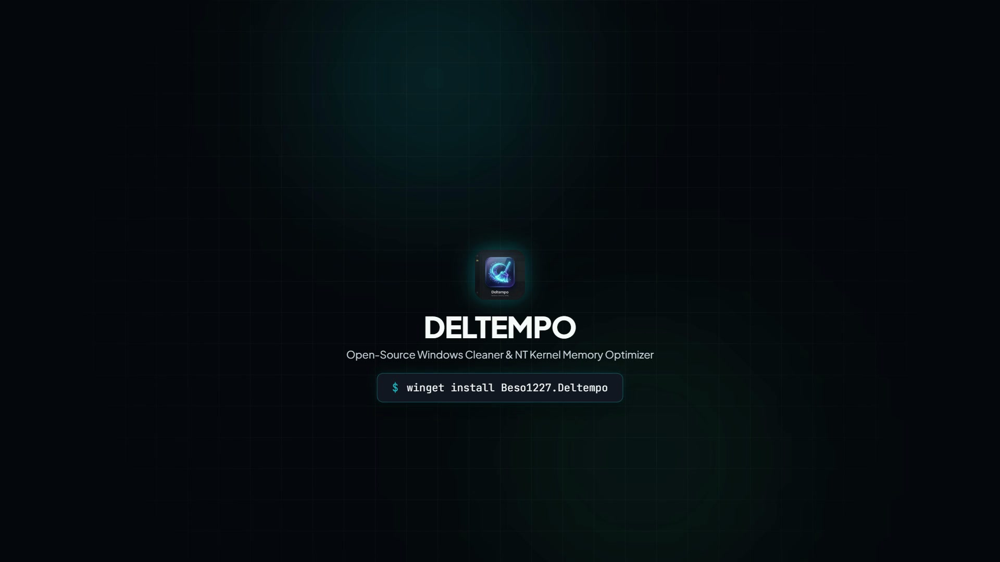

<div align="center">

  

  # Deltempo: Open-Source Windows Cleaner, App Uninstaller & Memory Optimizer

  <p><strong>Fast, privacy-first Windows cleaner, deep root uninstaller, startup intelligence engine, and NT memory optimizer for Windows 10 & 11.</strong></p>

  <p>
    <a href="https://github.com/Beso1227/Deltempo/releases/latest"></a>
    <a href="https://github.com/Beso1227/Deltempo/actions/workflows/ci.yml"></a>
    <a href="docs/TESTING.md"></a>
    <a href="docs/THREAT_MODEL.md"></a>
    <a href="LICENSE"></a>
    <a href="#supported-platforms"></a>
  </p>

  <p>
    <a href="https://github.com/Beso1227/Deltempo/releases/latest">Download v1.7.0</a> •
    <a href="https://beso1227.github.io/Deltempo/"><strong>Deltempo Official Website</strong></a> •
    <a href="docs/ARCHITECTURE.md">Architecture</a> •
    <a href="docs/THREAT_MODEL.md">Threat Model</a> •
    <a href="docs/TESTING.md">Testing Guide</a> •
    <a href="docs/BENCHMARKS.md">Benchmarks</a> •
    <a href="docs/RELEASES.md">Release Engineering</a> •
    <a href="SECURITY.md">Security Policy</a> •
    <a href="#quick-start">Quick Start</a>
  </p>

  <br />

  <a href="https://beso1227.github.io/Deltempo/#video">
    
  </a>
  <p><sub>🎬 <strong><a href="https://beso1227.github.io/Deltempo/brag.mp4">Watch the 20-second Deltempo launch overview video</a></strong> (1080p)</sub></p>

</div>

---

## At a Glance

| Property | Detail |
| :--- | :--- |
| **Official Website** | [beso1227.github.io/Deltempo](https://beso1227.github.io/Deltempo/) |
| **Platform** | Windows 10 & 11 (64-bit / x64) |
| **Version** | v1.7.0 (Production Release) |
| **License** | Open Source ([MIT](LICENSE)) |
| **Interfaces** | Modern Desktop GUI (WPF Fluent) and Headless Terminal CLI |
| **Distribution** | Portable single-file executable (self-contained, no installer required) |
| **Test Coverage** | 581 automated tests (100% pass rate, 0 failed, 0 skipped), adversarial filesystem fuzzing |
| **Telemetry** | Zero telemetry. Scan, clean, memory, and uninstaller operations execute 100% offline |
| **Safety Engine** | Two-phase planning (`SCAN → PLAN → PROTECT → REVALIDATE → CLEAN`) with 5 risk tiers & transaction journaling |
| **App Uninstaller** | Bulk silent uninstaller, BCU engine, leftover AppData/Registry trace cleanup, forced wipe for broken apps |
| **Service Intelligence** | Explains: *"Will anything go wrong if I disable this?"* via 3 safety verdicts, offline heuristics & multi-model AI |
| **Process Manager** | Real-time process listing with live high-DPI application icon extraction and memory footprint analysis |
| **WinUtil Integration** | 1-Click launcher for Chris Titus Tech WinUtil (CTT) utility directly from the toolbar |
| **Memory Engine** | Native Windows NT kernel calls (`NtSetSystemInformation`, `EmptyWorkingSet`) |
| **Preferences Hub** | Categorized 4-tab control center (*Updates*, *General*, *Memory*, *Storage & Safety*) |
| **Tray Guardian** | High-DPI native Win32 icon (`LoadCrispTrayIcon`) with live RAM telemetry & 1-click Boost |
| **Updates** | Cryptographically verified (SHA-256) Stable & Beta release channels with atomic staging |

---

## What is Deltempo?

**Deltempo** is a modern, open-source Windows maintenance suite built to safely reclaim storage space, thoroughly uninstall stubborn software, monitor startup boot impact, and optimize system memory. It purges disposable application caches, orphaned installer remnants, build artifacts, and stale system logs without touching personal documents, browser credentials, or critical operating system components.

Traditional cleanup utilities often function as opaque black boxes, install bundled adware, or leave deep registry residue behind. Deltempo is engineered on a **safety-first architecture**: candidate paths are classified into explicit risk tiers, simulated before deletion, bounded within authorized directory roots, and revalidated immediately before removal to guard against filesystem race conditions.

In addition to disk cleanup, Deltempo includes low-level Windows NT kernel memory management tools to flush standby page lists and trim inactive working sets through official Win32 and NT system calls.

---

## What's New in v1.7.0?

* 🚀 **Deep Root App Uninstaller**: Complete uninstaller tab powered by Bulk Crap Uninstaller (BCU) scanning engine. Detects Win32 desktop programs and Windows Store apps, initiates silent bulk uninstallation, sweeps leftover registry keys and AppData folders, and force-removes broken or half-deleted applications.
* 🛡️ **Application Intelligence & Expandable Briefings**: Click on any installed application to reveal an interactive, expandable card showing installation root, registry keys, publisher verification, and an intelligent safety analysis detailing the app's purpose, background services, and removal impact.
* 🧠 **Startup Service Intelligence ("Will anything go wrong?")**: Solves the dilemma of disabling startup items. Each service is evaluated with a clear 3-tier verdict badge (`SafeToDisable`, `CautionNeeded`, `EssentialKeep`), backed by an offline heuristic safety engine and multi-provider AI support (OpenAI, Anthropic, Gemini, Groq, OpenRouter, Ollama, LM Studio).
* 🛠️ **Chris Titus Tech WinUtil (CTT) 1-Click Launcher**: Integrated launcher button directly in the desktop interface for Chris Titus Tech's renowned Windows Utility, running directly in an elevated PowerShell session without manual command typing.
* 🎨 **Process Manager with Native Icons**: The live process manager extracts and displays high-DPI 32-bit application icons directly from running PE binaries alongside RAM usage and PID metrics.
* 🧪 **Expanded Verification Suite**: 581 automated unit and integration tests (100% pass rate) with zero failures or regressions.

---

## Why Deltempo?

* **Open Source & Auditable**: Permissively licensed under MIT. Every cleanup rule, safety check, and native API call is transparent C# code.
* **Safety-First Architecture**: Features a deterministic two-phase model (`SCAN → PLAN → PROTECT → REVALIDATE → CLEAN`) with path boundary enforcement, reparse point rejection, and protected folder shields.
* **Deep Root Uninstallation**: Thoroughly removes stubborn programs and automatically detects and cleans orphaned leftovers that default uninstallers leave behind.
* **Intelligent Startup Decisions**: Eliminates guesswork around startup items with verified safety ratings and deep component breakdowns.
* **Native Windows NT Memory Management**: Purges standby memory lists and trims process working sets via `NtSetSystemInformation` and `EmptyWorkingSet`.
* **Crisp High-DPI Tray Guardian**: Renders pixel-perfect 32-bit alpha icons across 100% to 200%+ DPI, displays real-time RAM usage in the tooltip, and recovers automatically on `explorer.exe` restarts.
* **Preferences & Update Hub**: Features a tabbed control center organizing update schedules, release channels (*Stable* vs *Beta*), low disk alerts, and memory auto-trimming.
* **Dual Interface (GUI & CLI)**: Use the desktop interface for interactive analysis or automate scheduled maintenance via the scriptable CLI with structured JSON support.
* **Zero Telemetry & Local Execution**: Routine operations run entirely offline. Contains no analytics tracking, advertisements, or third-party telemetry libraries.
* **Portable Operation**: Shipped as a self-contained single-file executable. No background daemons or separate runtime installations are required.

---

## Deep Root App Uninstaller

The **App Uninstaller** tab provides comprehensive software management for Windows 10 and 11:

```text
┌─────────────────┐     ┌───────────────────────┐     ┌────────────────────────┐
│  INVENTORY APPS │ ──► │  EXPAND INTEL & RISK  │ ──► │  UNINSTALL & SWEEP RES │
└─────────────────┘     └───────────────────────┘     └────────────────────────┘
```

* **Complete Inventory**: Scans both 64-bit and 32-bit `Uninstall` registry hives (`HKLM`, `HKCU`) and AppX packages, retrieving program display names, icons, versions, publishers, and installation sizes.
* **Expandable App Intelligence**: Click any app row to expand an in-depth intelligence card showing:
  * Install location and registry uninstall string.
  * Application description, category, and background service footprint.
  * Removal risk assessment detailing whether user configuration or related tools will be affected.
* **Multi-App Silent Bulk Removal**: Select multiple applications and execute unattended uninstalls without clicking through endless installer wizard windows.
* **Leftover Trace Sweeper**: Post-uninstallation scanner identifies orphaned registry entries (`HKCU\Software`, `HKLM\Software`), residual AppData directories (`Roaming`, `Local`, `ProgramData`), and start menu shortcuts.
* **Force Wipe Broken Apps**: For applications whose uninstaller binaries are missing or corrupt, Deltempo forcefully purges associated filesystem directories and deregisters orphan registry nodes.

---

## Startup Manager & Service Intelligence

The **Startup Manager** inspects programs and services configured to boot with Windows, answering the common question:

> **"Will anything go wrong if I disable this?"**

* **3-Tier Safety Verdicts**:
  * 🟢 `SafeToDisable`: Pure user-space convenience apps (game launchers, chat clients, cloud updaters) that run fine on manual demand.
  * 🟡 `CautionNeeded`: Hardware control panels (audio control, trackpad gestures, graphics tray tools) where disabling may turn off quick hotkeys.
  * 🔴 `EssentialKeep`: Core security software, backup synchronization agents, or peripheral drivers critical for regular operation.
* **Dual Intelligence Pipeline**:
  1. **Offline Heuristics**: Deterministic classification based on known binary publishers, digital signatures, executable paths, and known service profiles.
  2. **AI Deep Dive (Multi-Provider)**: Optional 1-click AI analysis providing deep operational summaries without transmitting private data (only application metadata). Supports OpenAI, Anthropic Claude, Google Gemini, Groq, OpenRouter, and local offline models (Ollama, LM Studio).
* **100% Reversible Registry Toggles**: Disabled entries are preserved in a dedicated backup hive (`Run_Deltempo_Disabled`), allowing you to restore any startup program with a single click.

---

## Safety Architecture

The foundational rule of Deltempo's deletion engine is:

> **Never optimize for deleting more files. Optimize for proving that every deletion is safe.**

```text
┌────────┐     ┌────────┐     ┌─────────┐     ┌────────────┐     ┌─────────┐
│  SCAN  │ ──► │  PLAN  │ ──► │ PROTECT │ ──► │ REVALIDATE │ ──► │  CLEAN  │
└────────┘     └────────┘     └─────────┘     └────────────┘     └─────────┘
```

### Safety Pipeline Stages

1. **Scan**: Identifies candidate files in authorized scopes and extracts metadata (size, age, attributes, and path hierarchy).
2. **Plan**: Compiles a `CleanupPlan`. Dry-run simulation uses the same cleanup planning pipeline as live cleanup to preview candidate actions without executing destructive operations.
3. **Protect**: Matches paths against protection policies, shielding user directories (Documents, Pictures, Desktop), source code repositories, SSH keys, credentials, and active session tokens.
4. **Revalidate**: Mitigates TOCTOU (time-of-check to time-of-use) risk by revalidating canonical path identity, containment boundaries, reparse points, and attributes immediately before destructive operations.
5. **Clean**: Executes approved deletions while producing a structured transaction log of processed, deleted, recycled, and skipped bytes.

### 5-Tier Safety Classification

| Risk Tier | Scope & Classification | Policy & Runtime Action |
| :--- | :--- | :--- |
| **Protected** | System & User Files | Core OS binaries, personal user folders (Documents, Desktop), source repositories, SSH keys, credentials, and session stores. **Strictly immutable — deletion blocked.** |
| **Safe** | Verified Caches | Deterministically verified temporary data located strictly within an authorized scope and matching known cache patterns. **Eligible for deletion.** |
| **LowRisk** | Aged Temp Files | Temporary files exceeding conservative age thresholds (e.g., >24 hours) or inactive crash reports. **Eligible for deletion.** |
| **ReviewRequired** | Ambiguous / Executables | Files in disposable locations that contain executable headers, unknown extensions, or active locks. **Defaults to KEEP.** |
| **Unknown** | Unverified Context | Any file or directory where safety cannot be proven conclusively from verified rules. **Strictly preserved.** |

### Additional Defensive Controls
* **Reparse Point & Symlink Defense**: Rejects NTFS junctions, symbolic links, and volume mount points to prevent directory traversal outside target roots.
* **Local Drive Boundary**: Confined to local fixed physical drives; remote network shares and UNC paths are rejected.
* **Windows Recycle Bin Support**: Deletions can be routed through the Windows Shell Recycle Bin (`SHFileOperation`) for reversible file recovery.

---

## Quick Start

### Running the Desktop Application (GUI)

1. Download **`Deltempo.exe`** from the [Latest Release](https://github.com/Beso1227/Deltempo/releases/latest) page.
2. Run `Deltempo.exe` (no installation required).
3. Click **Scan** to analyze cleanable data across selected categories.
4. Review the candidate list and click **Clean** to reclaim space.

### Installing via WinGet

```powershell
winget install Beso1227.Deltempo
```

### Running via Command Line (CLI)

Running `Deltempo.exe` automatically registers user-level App Paths and a PowerShell profile helper so `deltempo` can be invoked directly from terminal sessions without modifying system directories:

```powershell
# Preview cleanable targets without deleting files
deltempo clean --dry-run

# Run safe cleanup routing disposable files to the Recycle Bin
deltempo clean --safe --recycle-bin

# Flush standby memory lists and trim inactive working sets
deltempo boost

# Inspect system status and memory distribution in JSON format
deltempo status --json
```

---

## CLI Reference

Deltempo includes a synchronous, scriptable CLI designed for terminal users and automated maintenance routines.

### Command Overview

| Command | Purpose | Key Flags & Options |
| :--- | :--- | :--- |
| `deltempo scan [filter]` | Scan targets for disposable data | `--json`, `--silent` |
| `deltempo clean [filter]` | Clean disposable caches | `--dry-run`, `--recycle-bin`, `--safe`, `--all`, `--json`, `--yes` |
| `deltempo smart-clean` | Quick purge of verified safe caches | `--dry-run`, `--json`, `--yes` |
| `deltempo deep-clean` | Autonomous full cleanup (RAM, DISM, scopes) | `--dry-run`, `--json`, `--yes` |
| `deltempo boost` | Optimize system memory | `--all`, `--standby`, `--cache`, `--workingsets`, `--json` |
| `deltempo large [path]` | Scan drives for space-consuming files | `--min <size>`, `--type <cat>`, `--safe`, `--top <n>`, `--sort <size\|date>` |
| `deltempo large inspect <file>` | Inspect file risk tier and safety verdict | `--json` |
| `deltempo large clean` | Recycle disposable large files | `--dry-run`, `--yes`, `--safe-only` |
| `deltempo startup [list]` | Inspect startup applications and boot impact | `--high`, `--json` |
| `deltempo startup disable <app>` | Reversibly disable a startup program | N/A |
| `deltempo startup enable <app>` | Restore a disabled startup program | N/A |
| `deltempo repair [subcommand]` | Windows integrity check & servicing repair | `sfc`, `dism`, `winsxs`, `chkdsk`, `update`, `network` |
| `deltempo status` | Display system telemetry and memory info | `--json` |
| `deltempo update [check]` | Check for official releases or apply update | `check`, `--dry-run` |
| `deltempo register` | Opt-in shell integration (PATH, Win+R alias, PowerShell function) | `--status`, `--remove` |
| `deltempo unregister` | Remove all shell integration | N/A |

---

## Cleaning Targets

Deltempo provides 25+ built-in cleanup scopes across system, developer, and application caches. Scopes marked with an asterisk require administrative elevation.

| Domain | Scope Targets | Examples of Cleaned Data |
| :--- | :--- | :--- |
| **Windows System** | User Temp, System Temp*, Prefetch*, Update Cache*, Upgrade Residue*, Delivery Optimization*, Component Caches*, Diagnostic Logs*, Crash Dumps*, Thumbnails | `%TEMP%`, `C:\Windows\Temp`, `Prefetch`, `SoftwareDistribution\Download`, `$WINDOWS.~BT`, `DeliveryOptimization\Cache`, `WinSxS\Temp`, `Minidump`, `thumbcache_*.db` |
| **Drivers & GPU** | Driver Packages*, GPU Shader Pools | NVIDIA App/GeForce OTA packages, AMD/Intel temp installers, DirectX (`D3DSCache`), Vulkan (`GLCache`) |
| **Gaming & Media** | Game Launchers, Creator Render Caches | Steam downloads & shader pools, Epic Games webcache, Adobe Media Cache, DaVinci proxies, Blender temp |
| **Apps & Social** | Desktop Apps, Messaging Apps, Windows Store Apps, Orphaned AppData | Discord, Spotify, Slack, VS Code caches; WhatsApp/Telegram caches (sessions preserved); uninstalled app folders |
| **Developer Tools** | Package Caches, Dev Daemons | NuGet v3, npm, pip, yarn, pnpm, Cargo, Go build, .gradle, and Android Studio emulator temp caches |
| **Web Browsers** | Chromium Profiles, Gecko Profiles, Temporary Internet | Multi-profile web and shader caches for Chrome, Edge, Brave, Opera, Vivaldi, Firefox, Arc (logins preserved) |
| **Recovery** | Windows Recycle Bin, VSS Restore Points* | Empties `$Recycle.Bin` across mounted drives; purges older VSS shadow copies while retaining the latest |

> [!NOTE]
> Personal documents, browser cookies, saved passwords, active authentication sessions, and source code repositories are strictly excluded from cleanup.

---

## Memory Optimization

Windows caches recently accessed files in the **Standby Page List**. While this optimizes file access, fragmented standby caches or unreleased working sets from closed apps can cause memory pressure during resource-intensive workloads.

Deltempo interfaces directly with native Windows memory management routines:

* **Standby List Invalidation**: Invokes `NtSetSystemInformation` with `SystemMemoryListInformation` (class `80`) to flush standby pages back to the free memory pool.
* **Process Working Set Trimming**: Requests `SeProfileSingleProcessPrivilege` and `SeDebugPrivilege` to call `EmptyWorkingSet` across inactive processes.
* **System File Cache Boundary Reset**: Calls `SetSystemFileCacheSize` to reset filesystem cache boundaries when cache growth becomes excessive.
* **Modified Page Flush**: Commits dirty memory pages to disk before releasing physical memory.
* **Protected Process Shielding**: Automatically excludes core system processes (`csrss.exe`, `dwm.exe`, `explorer.exe`, `lsass.exe`, `services.exe`, `smss.exe`, `svchost.exe`, and Windows Defender) from trimming operations.

---

## Process Manager with Live Icons

The **Process Manager** provides real-time visibility into running Windows processes:

* **Native High-DPI Icon Extraction**: Dynamically extracts crisp 32-bit executable icons directly from running process binaries using native Win32 `SHGetFileInfo` and `ExtractIconEx` routines.
* **Resource Monitoring**: Track process ID (PID), working set memory usage, publisher name, and execution path.
* **Safe Termination**: Terminate runaway or frozen tasks with confirmation guards that protect critical system processes.

---

## Chris Titus Tech WinUtil (CTT) Integration

Deltempo includes direct integration with [Chris Titus Tech's Windows Utility (WinUtil)](https://github.com/ChrisTitusTech/winutil):

* **1-Click Launch**: Accessible directly from the main toolbar or tools menu.
* **Elevated Execution**: Spawns the official CTT initialization pipeline via PowerShell with administrator elevation.
* **Synergistic Tweaks**: Ideal companion tool for applying deep Windows debloating, telemetry disabling, and package installation alongside Deltempo's disk and memory optimizations.

---

## Preferences & Update Hub

Deltempo features a categorized, segmented preferences center organized into four dedicated operational tabs:

* **Updates Tab**:
  * **Release Channels**: Switch between **Stable** (verified milestone releases recommended for all users) and **Beta / Pre-Release** (early access to cutting-edge features and experimental scopes).
  * **Automated Schedule**: Configure background update polling frequency: `Daily`, `Every 3 Days`, `Weekly`, or `Manual Only`.
  * **Silent Pre-Fetching**: Optionally stage verified update packages in the background so updates apply instantly upon confirmation.
  * **Version Telemetry Card**: Real-time status badge showing current installed version (`v1.7.0`), last checked timestamp, update check button, and 1-click link to official GitHub Release Notes.
* **General Tab**:
  * **System Startup**: Reversibly configure Deltempo to launch on Windows logon with optional auto-minimize to tray.
  * **Recycle Bin Routing**: Global toggle to route candidate files to the Windows Recycle Bin for safety and reversible recovery.
* **Memory Tab**:
  * **Background Auto-Boost**: Automatically purge standby lists and trim inactive working sets when system memory usage crosses user-defined pressure thresholds (e.g., 85%).
* **Storage & Safety Tab**:
  * **Low Disk Alerts**: Custom threshold alerts (`5 GB`, `10 GB`, `15 GB`, `20 GB`, `50 GB`) to warn operators before drive capacity exhaustion induces system instability or paging crashes.
  * **Safety Shields**: Enforce immutable directory locks on personal folders, repositories, and credentials.

---

## High-DPI System Tray Guardian

For background monitoring and fast access, Deltempo integrates a lightweight system tray daemon:

* **Native Win32 Scaling (`LoadCrispTrayIcon`)**: Employs direct Win32 GDI icon creation (`CreateIconIndirect`) with 32-bit ARGB alpha transparency, delivering pixel-perfect crispness on standard (100%), medium (125%, 150%), and high-density (175%, 200%+) Windows displays without blurring.
* **Real-Time RAM Telemetry**: Hovering over the tray icon displays live physical memory consumption directly in the tooltip:
  ```text
  Deltempo v1.7.0
  RAM: 42% (13.4 GB / 31.9 GB)
  ```
* **Instant Context Actions**: Right-click the tray icon to trigger **1-Click Boost Memory** or **Quick Smart Clean** immediately without bringing the main application window into focus.
* **Explorer Restart Resilience**: Automatically registers for the Win32 `TaskbarCreated` broadcast message, ensuring the tray icon seamlessly re-attaches if `explorer.exe` restarts or crashes.

---

## Automatic Updates

Deltempo auto-updates exclusively when a verified release is published to GitHub Releases:

* **Official GitHub Releases**: Queries the GitHub Releases API to discover verified builds matching the configured channel (*Stable* or *Beta*).
* **Cryptographic Hash Validation**: Every downloaded update is verified against expected SHA-256 digests by `PatchIntegrityVerifier` before any staging operation.
* **Host & Protocol Security**: `UpdateSecurityValidator` enforces strict HTTPS protocol and verified GitHub domain origin controls (`api.github.com`, `github.com`).
* **Atomic Swap & Rollback**: Staged updates are installed using cross-process mutex locks (`PatchInstallationLock`). If the new binary fails verification, the previous build is restored.

---

## Privacy

* **Does Deltempo collect telemetry?** No. Deltempo contains no telemetry, user tracking, or analytics libraries.
* **Does cleanup data leave your machine?** No. All scanning, classification, and deletion routines execute entirely on local drives.
* **What network communication occurs?** Network requests are strictly limited to HTTPS queries to GitHub (`api.github.com`, `github.com`) for release checks and verified update downloads, plus the optional AI analysis described below.
* **When does Deltempo contact GitHub?** Only when update checks are performed (via `deltempo update` or GUI settings).
* **Optional AI safety analysis (off by default)**: The *AI File & App Safety Intelligence* features are disabled by default. When enabled, the default `BuiltIn` provider works from a local fingerprint knowledge base and, only for unrecognized items, queries DuckDuckGo's Instant Answer API with the **name alone**. Cloud providers (OpenAI, Gemini, Groq, OpenRouter) transmit an **anonymized metadata summary only** — item name, size, vendor metadata, signature status, and generalized context with usernames stripped. **File contents are never uploaded.** Selecting a local provider (Ollama, LM Studio) keeps the entire workflow offline.
* **Shell integration is explicit and reversible**: The CLI never modifies your PATH, registry, or PowerShell profile implicitly — only `deltempo register` does. The GUI performs the same registration on first launch (equivalent to an installer step). Inspect the current state with `deltempo register --status` and remove it completely with `deltempo unregister`.

---

## Supported Platforms

| Operating System | Architecture | Support Status | Minimum Requirement |
| :--- | :--- | :--- | :--- |
| **Windows 11** | `x64` (AMD64) | **Supported** | Version 21H2 or newer (64-bit) |
| **Windows 10** | `x64` (AMD64) | **Supported** | Version 1809 or newer (64-bit) |
| **Windows ARM64** | `ARM64` | **Experimental** | Supported via Windows 11 x64 emulation |
| **Windows 7 / 8.1** | Any | **Unsupported** | Target framework requires Windows 10+ |

Deltempo is compiled as a self-contained single-file executable (`win-x64`). No separate .NET runtime installation is required.

---

## Development

### Prerequisites
* Windows 10 or 11 (64-bit)
* [.NET 10.0 SDK](https://dotnet.microsoft.com/download/dotnet/10.0)
* PowerShell 7+ or Windows PowerShell 5.1

### Clone & Build
```powershell
# Clone the repository
git clone https://github.com/Beso1227/Deltempo.git
cd Deltempo

# Build entire solution (Core library, GUI, CLI, and Tests) in Release configuration
dotnet build deltempo.sln -c Release

# Run the automated test suite
dotnet test Tests/Deltempo.Tests/Deltempo.Tests.csproj -c Release

# Package the standalone release executables (GUI and CLI)
pwsh -ExecutionPolicy Bypass -File scripts/build_release_exe.ps1
```
The compiled single-file binaries are generated at `publish/Deltempo.exe` and `publish/deltempo_cli.exe`.

---

## Testing

Deltempo maintains an automated test suite using **xUnit** on .NET 10:

```powershell
dotnet test Tests/Deltempo.Tests/Deltempo.Tests.csproj -c Release
```

### Coverage Scope
* **Path Security**: Canonicalization, prefix boundary containment, traversal attack prevention, junction detection, and UNC path rejection.
* **Safety Classification**: Validation that user profiles, personal documents, credentials, repositories, and system binaries are classified as `Protected`.
* **Two-Phase Cleanup Planning**: Validates that dry-run simulations match live candidate sets and that pre-deletion revalidation catches altered disk state.
* **App Uninstaller & Leftover Sweeper**: Verification of BCU registry parsing, silent uninstall command construction, and orphaned leftover path matching.
* **Startup Service Intelligence**: Verification of 3-tier verdict resolution, offline heuristics, and reversibility of startup entries.
* **Update Verification**: Schema validation, host allowlisting, HTTPS enforcement, and SHA-256 payload integrity.
* **Service Integrations**: Memory telemetry queries, startup registry key toggles, and file classification heuristics.

---

## Security

Deltempo is built with security as a foundational requirement, not an afterthought.

### Security Posture
* **Vulnerability disclosure**: Please review [SECURITY.md](SECURITY.md) for vulnerability disclosure guidelines. To report a security vulnerability or a safety engine bypass, please open a private security advisory on GitHub or contact the maintainers.
* **Automated scanning**: CodeQL security analysis runs on every push, pull request, and weekly schedule. Dependabot monitors NuGet and GitHub Actions dependencies.
* **Deterministic safety engine**: rule-based file classification with 24-hour safety shield, no heuristics guessing.
* **Zero telemetry by design**: no analytics, no tracking, no phone-home; all processing is local.
* **Opt-in network features**: AI analysis and CLI registration require explicit user action.
* **Reproducible builds**: release workflow builds standalone self-contained executables from tagged sources with SHA-256 verification.

### Security Controls Summary
| Control | Implementation |
| :--- | :--- |
| **Update Integrity** | HTTPS-only, GitHub host allowlisting, SHA-256 digests, ECDSA P-256 signatures |
| **Cleanup Safety** | Two-phase `SCAN → PLAN → PROTECT → REVALIDATE → CLEAN` with reparse-point rejection |
| **Shell Integration** | Strictly opt-in via `deltempo register`, fully reversible via `deltempo unregister` |
| **AI Privacy** | Off by default; transmits item metadata only, never file contents |
| **Path Security** | Canonicalization, prefix containment, traversal attack prevention, junction detection |
| **Response SLA** | Acknowledgment within 3 business days, critical fixes within 14 days |

---

## Contributing

1. Fork the repository on GitHub.
2. Create a focused branch (`git checkout -b feature/new-scope`).
3. Make changes adhering to established C# coding conventions and safety invariants.
4. Run the test suite (`dotnet test Tests/Deltempo.Tests/Deltempo.Tests.csproj -c Release`).
5. Open a Pull Request with a clear description of your changes.

For further guidelines, see [CONTRIBUTING.md](CONTRIBUTING.md).

---

## License

Deltempo is open-source software licensed under the **[MIT License](LICENSE)**.

```text
Copyright (c) 2026 Beso1227 / Deltempo Project
```

---

## Links

| Resource | Description | Location |
| :--- | :--- | :--- |
| **Official Website** | Product overview, interactive simulator, and showcase | [beso1227.github.io/Deltempo](https://beso1227.github.io/Deltempo/) |
| **Documentation** | User guides and architecture documentation | [beso1227.github.io/Deltempo/docs/](https://beso1227.github.io/Deltempo/docs/) |
| **Latest Releases** | Standalone binaries and milestone release notes | [GitHub Releases](https://github.com/Beso1227/Deltempo/releases) |
| **Changelog** | Complete history of changes and milestones | [docs/changelog/](https://beso1227.github.io/Deltempo/changelog/) |
| **FAQ** | Frequently asked questions | [docs/faq/](https://beso1227.github.io/Deltempo/faq/) |
| **Security Policy** | Vulnerability disclosure and security posture | [SECURITY.md](SECURITY.md) |
| **Contributing** | Contributor guidelines and coding rules | [CONTRIBUTING.md](CONTRIBUTING.md) |
| **Issue Tracker** | Bug reports, feature requests, and discussions | [GitHub Issues](https://github.com/Beso1227/Deltempo/issues) |
