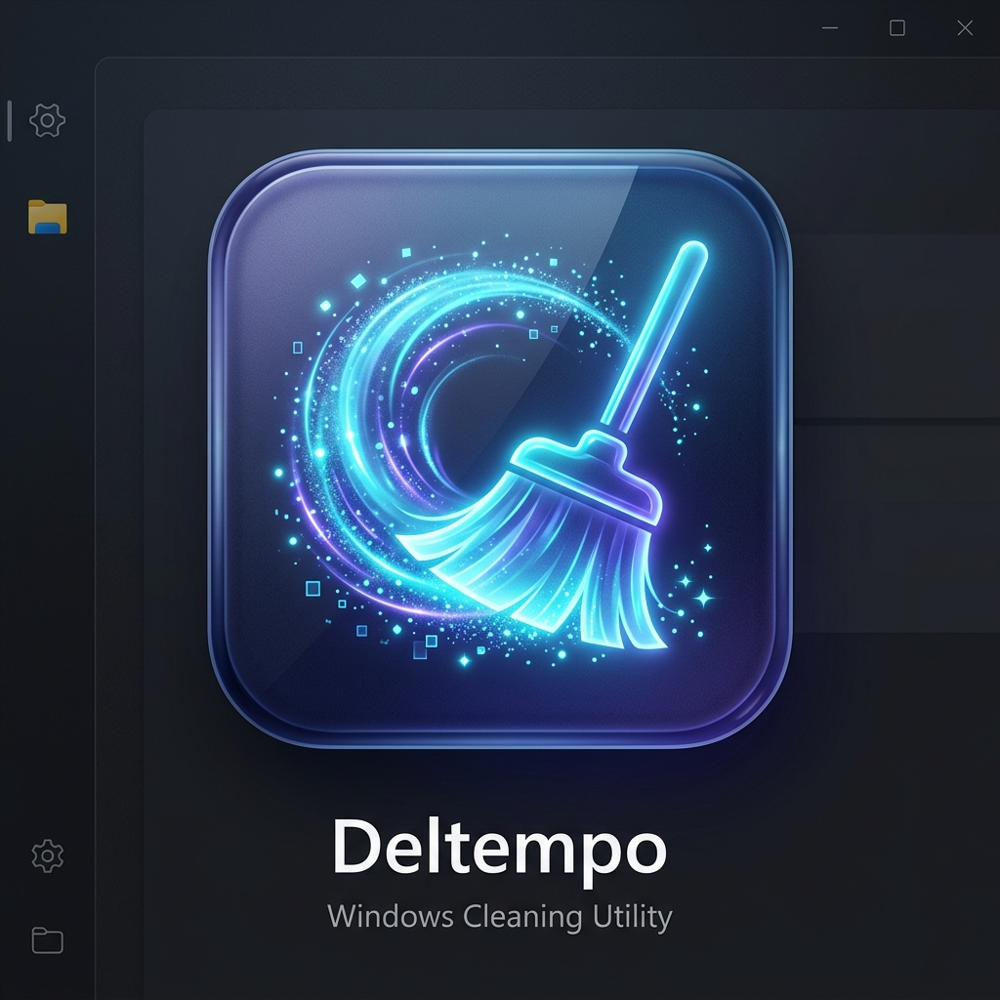

<div align="center">

  

  # Deltempo — The Fast, Free & Open-Source Windows Cleaner
  ### A 100% transparent, zero-bloat, single-file portable Windows cleanup utility & modern CCleaner alternative.

  [](https://github.com/yourusername/deltempo/releases)
  [](https://opensource.org/licenses/MIT)
  [-0078D6?style=for-the-badge&logo=windows)](https://github.com/yourusername/deltempo)
  [](https://github.com/yourusername/deltempo/releases)
  [](https://github.com/yourusername/deltempo)

  <p align="center">
    <a href="#-quick-download">Quick Download</a> •
    <a href="#-features">Features</a> •
    <a href="#-why-deltempo-vs-others">Why Deltempo?</a> •
    <a href="#-cleaning-categories">Cleanup Scope</a> •
    <a href="#-building-from-source">Build from Source</a> •
    <a href="#-faq">FAQ</a>
  </p>

</div>

---

## 🚀 Overview

**Deltempo** is an ultra-fast, modern, open-source Windows cleaner designed to safely reclaim gigabytes of wasted storage space. Unlike legacy optimizer tools that bundle background telemetry, aggressive ads, or fake "registry health" scores, Deltempo gives you **100% authentic byte-for-byte precision**, a beautiful **Dark Fluent Card UI**, and runs as a **single standalone portable executable** with zero setup required.

### 🌟 Key Highlights
- **Single Portable EXE**: No installer, no background services, no registry residue. Run it from your desktop or a USB drive.
- **Deep Precision Cleaning**: Safely wipes **User `%TEMP%`**, **Windows System Temp**, **Prefetch**, **Windows Update Download Cache** (often 5–20 GB), **Crash Dumps**, **Explorer Thumbnails**, **Recycle Bin**, and **Browser Caches**.
- **Real-Time Drive Telemetry**: Live Drive C: free space meter and real-time space reclaim animations.
- **Safety Shield**: Intelligent protection for files created or modified within the last 24 hours to prevent breaking active installer sessions.
- **Top Files Inspector**: Inspect any category to view the top 15 largest junk files with full paths and timestamps.
- **100% Privacy & Open-Source**: Zero telemetry, zero internet requests, MIT licensed.

---

## 📊 Why Deltempo vs. Others?

| Feature | 🛡️ Deltempo | Generic / Ad-Driven Cleaners | Built-in Disk Cleanup |
|---|:---:|:---:|:---:|
| **Open-Source & Free Forever** | **Yes (MIT)** | ❌ No (Freemium/Ads) | ⚠️ Proprietary |
| **Zero Install / Portable EXE** | **Yes (Single File)** | ❌ Needs Installer | ⚠️ System Tool |
| **Real Byte-for-Byte Precision** | **Yes** | ❌ Fake Scores & Popups | ⚠️ Basic |
| **Windows Update Cache Purge** | **Yes (5–20 GB Reclaimed)** | ⚠️ Limited / Paid | ⚠️ Slow / Manual |
| **Safety Shield (<24h Protection)**| **Yes** | ❌ Blind Deletion | ❌ No |
| **Top Junk Files Inspector** | **Yes (View Large Files)** | ❌ Paid / Paywall | ❌ No |
| **Modern Fluent Dark UI** | **Yes** | ❌ Outdated / Cluttered | ❌ Legacy UI |
| **Telemetry & Tracking** | **0% (None)** | ❌ Invasive Analytics | ⚠️ Microsoft Telemetry |

---

## 🧹 Cleaning Categories

Deltempo provides granular control with toggles for every major Windows junk repository:

1. **User Temp & Cache (`%TEMP%`)**: Cleans temporary cache files, unzipped installer remnants, and application scratch data in `AppData\Local\Temp`.
2. **Windows System Temp (`C:\Windows\Temp`)**: Safely removes OS diagnostic traces, update scratchpads, and system temporary files.
3. **Windows Prefetch Cache (`C:\Windows\Prefetch`)**: Purges stale execution traces and cached launch indexes.
4. **Windows Update Cache (`SoftwareDistribution\Download`)**: Removes obsolete Windows Update download files and cached installers.
5. **Error Reports & Crash Dumps (`WER` / `CrashDumps`)**: Cleans Windows Error Reporting logs and memory crash dumps.
6. **Explorer Thumbnail & Icon Caches (`thumbcache_*.db`)**: Fixes corrupted and bloated icon/thumbnail databases.
7. **Windows Recycle Bin**: Empties deleted files across all local drives via the official Windows Shell API.
8. **Browser Web Caches (Chrome, Edge, Brave)**: Wipes temporary cached media, stylesheets, and scripts while **keeping cookies, passwords, and sessions 100% safe**.

---

## 📥 Quick Download

Get the latest single-file portable release from the official [GitHub Releases page](https://github.com/yourusername/deltempo/releases):

| Download | Size | Description |
|---|---|---|
| **[Deltempo.exe (Portable)](https://github.com/yourusername/deltempo/releases/latest)** | **~2.4 MB** | Single standalone `.exe` (requires .NET 10 desktop runtime) |
| **[Deltempo-Standalone.exe](https://github.com/yourusername/deltempo/releases/latest)** | **~65 MB** | 100% Self-contained single `.exe` (runs on any Windows 10/11 PC with zero prerequisites) |

### Running the App:
1. Double-click `Deltempo.exe`.
2. Accept the Windows UAC Administrator prompt (required to clean system-protected directories like `C:\Windows\Temp` and `Prefetch`).
3. Click **Scan All** or customize your selection.
4. Click **Clean Selected** to safely wipe junk files!

---

## 🛠️ Building from Source

### Prerequisites
- Windows 10 / 11 (64-bit)
- [.NET 10 SDK](https://dotnet.microsoft.com/download/dotnet/10.0)

### Clone & Build
```bash
# Clone repository
git clone https://github.com/yourusername/deltempo.git
cd deltempo

# Run automated tests
dotnet build
.\bin\Debug\net10.0-windows\WinTempCleaner.exe --test

# Publish single portable executable
dotnet publish WinTempCleaner.csproj -c Release -r win-x64 --self-contained false -o ./dist
```

---

## ❓ Frequently Asked Questions (FAQ)

### Is it safe to delete Windows Temp and %TEMP% files?
**Yes.** Temporary files are created by software and Windows for short-term operations. Once the applications close, these files become orphaned junk. Deltempo safely skips files currently in use by active programs.

### What is the Safety Shield?
When enabled, Deltempo's **Safety Shield** ignores files created or modified within the last 24 hours. This prevents accidental deletion of temporary files belonging to software installers or unpack operations currently in progress.

### Will cleaning browser cache log me out of websites?
**No.** Deltempo only purges temporary web media and script caches (`Cache_Data`). Your login cookies, saved passwords, browsing history, and bookmarks remain completely untouched.

### Why does Deltempo require Administrator privileges?
Folders like `C:\Windows\Temp`, `C:\Windows\Prefetch`, and `SoftwareDistribution\Download` are protected by Windows system security. Administrative privileges are required to scan and remove obsolete files from these system locations.

---

## 🤝 Contributing & Community

Contributions, feature ideas, and bug reports are welcome!
- Open an [Issue](https://github.com/yourusername/deltempo/issues) to report bugs or request features.
- Submit a [Pull Request](https://github.com/yourusername/deltempo/pulls) to improve the codebase.

---

## 📄 License

Deltempo is open-source software licensed under the [MIT License](LICENSE).
