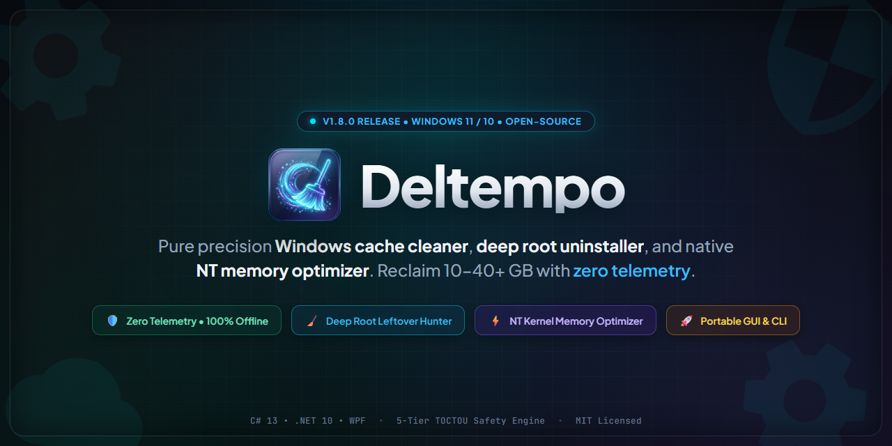

<div align="center">

  <a href="https://beso1227.github.io/Deltempo/">
    
  </a>

  <br />

  # Deltempo: Limpeza de Windows de código aberto, desinstalador de aplicativos e otimizador de memória

  <p align="center">
    <strong>README:</strong>
    <a href="README.md">English</a> ·
    <a href="README.es.md">Español</a> ·
    <a href="README.zh-CN.md">简体中文</a> ·
    <a href="README.hi.md">हिन्दी</a> ·
    <a href="README.fr.md">Français</a> ·
    <b>Português</b> ·
    <a href="README.ar.md">العربية</a> ·
    <a href="README.ru.md">Русский</a> ·
    <a href="README.ja.md">日本語</a>
  </p>

  <p><strong>Limpeza de disco e otimizador de RAM gratuitos e de código aberto para Windows 10 &amp; 11. Recupere de 10 a mais de 40 GB de arquivos temporários, lixo do AppData e caches de shaders de GPU — além de um desinstalador profundo de aplicativos e um localizador de arquivos duplicados. Zero telemetria, sem anúncios, sem instalador.</strong></p>

  <p>
    <a href="https://github.com/Beso1227/Deltempo/releases/latest/download/Deltempo.exe"><picture><source media="(prefers-color-scheme: dark)" srcset="https://img.shields.io/badge/DOWNLOAD%20FOR%20WINDOWS-00F2B0?style=for-the-badge&label=DELTEMPO&labelColor=16212B&height=48"></picture></a>
    <a href="https://beso1227.github.io/Deltempo/"><picture><source media="(prefers-color-scheme: dark)" srcset="https://img.shields.io/badge/OFFICIAL%20WEBSITE-8B5CF6?style=for-the-badge&label=VISIT&labelColor=16212B&height=48"></picture></a>
    <a href="https://github.com/Beso1227/Deltempo/releases/latest/download/deltempo_cli.exe"><picture><source media="(prefers-color-scheme: dark)" srcset="https://img.shields.io/badge/CLI%20INSTALLER-0DD3BA?style=for-the-badge&label=HEADLESS&labelColor=16212B&height=48"></picture></a>
    <a href="https://github.com/Beso1227/Deltempo"><picture><source media="(prefers-color-scheme: dark)" srcset="https://img.shields.io/badge/STAR%20THE%20REPO-F59E0B?style=for-the-badge&label=GITHUB&labelColor=16212B&height=48"></picture></a>
  </p>

  <p>
    <sub>Prefere o terminal? Uma única linha instala e verifica a versão mais recente &mdash;
      <code>irm https://beso1227.github.io/Deltempo/win | Invoke-Expression</code>
      &middot; Encontrou um bug ou tem uma ideia de recurso? <a href="https://github.com/Beso1227/Deltempo/issues/new/choose"><strong>Abra uma issue</strong></a> &mdash; todo pedido é lido.
      Se o Deltempo devolveu espaço em disco para você, uma <a href="https://github.com/Beso1227/Deltempo"><strong>estrela</strong></a> realmente ajuda outras pessoas a encontrá-lo.</sub>
  </p>

  <p>
    <a href="https://github.com/Beso1227/Deltempo/releases/latest"><picture><source media="(prefers-color-scheme: dark)" srcset="https://img.shields.io/github/v/release/Beso1227/Deltempo?style=for-the-badge&label=RELEASE&color=00F2B0&labelColor=16212B"></picture></a>
    <a href="https://github.com/Beso1227/Deltempo/actions/workflows/ci.yml"><picture><source media="(prefers-color-scheme: dark)" srcset="https://img.shields.io/github/actions/workflow/status/Beso1227/Deltempo/ci.yml?style=for-the-badge&label=CI&logo=github&labelColor=16212B"></picture></a>
    <a href="docs/TESTING.md"><picture><source media="(prefers-color-scheme: dark)" srcset="https://img.shields.io/badge/tests-726_passed-00F2B0?style=for-the-badge&label=QUALITY&labelColor=16212B"></picture></a>
    <a href="LICENSE"><picture><source media="(prefers-color-scheme: dark)" srcset="https://img.shields.io/github/license/Beso1227/Deltempo?style=for-the-badge&label=LICENSE&color=00F2B0&logo=github&labelColor=16212B"></picture></a>
  </p>

  <p>
    <a href="https://dotnet.microsoft.com/"><picture><source media="(prefers-color-scheme: dark)" srcset="https://img.shields.io/badge/.NET-10-512BD4?style=for-the-badge&label=RUNTIME&logo=dotnet&logoColor=white&labelColor=16212B"></picture></a>
    <a href="https://learn.microsoft.com/dotnet/csharp/"><picture><source media="(prefers-color-scheme: dark)" srcset="https://img.shields.io/badge/C%23-14-239120?style=for-the-badge&label=LANGUAGE&logo=csharp&logoColor=white&labelColor=16212B"></picture></a>
    <a href="#at-a-glance"><picture><source media="(prefers-color-scheme: dark)" srcset="https://img.shields.io/badge/windows_10_%2F_11_x64-0078D4?style=for-the-badge&label=PLATFORM&logo=windows&labelColor=16212B"></picture></a>
    <a href="https://github.com/Beso1227/Deltempo/releases/latest"><picture><source media="(prefers-color-scheme: dark)" srcset="https://img.shields.io/badge/portable_single--file-F59E0B?style=for-the-badge&label=BINARY&labelColor=16212B"></picture></a>
  </p>

  <p>
    <a href="#privacy"><picture><source media="(prefers-color-scheme: dark)" srcset="https://img.shields.io/badge/zero_telemetry-00F2B0?style=for-the-badge&label=PRIVACY&labelColor=16212B"></picture></a>
    <a href="docs/THREAT_MODEL.md"><picture><source media="(prefers-color-scheme: dark)" srcset="https://img.shields.io/badge/STRIDE_hardened-8B5CF6?style=for-the-badge&label=SECURITY&labelColor=16212B"></picture></a>
    <a href="docs/ARCHITECTURE.md#safety-pipeline"><picture><source media="(prefers-color-scheme: dark)" srcset="https://img.shields.io/badge/two--phase_verified-8B5CF6?style=for-the-badge&label=SAFETY&labelColor=16212B"></picture></a>
    <a href="docs/ARCHITECTURE.md"><picture><source media="(prefers-color-scheme: dark)" srcset="https://img.shields.io/badge/NT_kernel_native-0DD3BA?style=for-the-badge&label=MEMORY&labelColor=16212B"></picture></a>
  </p>

  <p>
    <a href="#quick-start"><picture><source media="(prefers-color-scheme: dark)" srcset="https://img.shields.io/badge/one--line_install-00F2B0?style=for-the-badge&label=SETUP&labelColor=16212B"></picture></a>
    <a href="https://github.com/Beso1227/Deltempo/releases"><picture><source media="(prefers-color-scheme: dark)" srcset="https://img.shields.io/github/downloads/Beso1227/Deltempo/total?style=for-the-badge&label=DOWNLOADS&color=00F2B0&logo=github&labelColor=16212B"></picture></a>
    <a href="https://github.com/Beso1227/Deltempo"><picture><source media="(prefers-color-scheme: dark)" srcset="https://img.shields.io/github/stars/Beso1227/Deltempo?style=for-the-badge&label=STARS&color=F59E0B&logo=github&labelColor=16212B"></picture></a>
    <a href="https://github.com/Beso1227/Deltempo/pulls"><picture><source media="(prefers-color-scheme: dark)" srcset="https://img.shields.io/badge/PRs_welcome-00F2B0?style=for-the-badge&label=CONTRIBUTING&labelColor=16212B"></picture></a>
  </p>

  <p>
    <sub>
      <a href="docs/ARCHITECTURE.md">Arquitetura</a> &middot;
      <a href="docs/THREAT_MODEL.md">Modelo de Ameaças</a> &middot;
      <a href="docs/TESTING.md">Guia de Testes</a> &middot;
      <a href="docs/BENCHMARKS.md">Benchmarks</a> &middot;
      <a href="docs/RELEASES.md">Engenharia de Releases</a> &middot;
      <a href="SECURITY.md">Política de Segurança</a> &middot;
      <a href="#quick-start">Início Rápido</a>
    </sub>
  </p>

  <br />

  <video src="docs/deltempo.mp4" poster="docs/deltempo.webp" controls preload="metadata" width="100%"></video>

</div>

---

  <a id="at-a-glance"></a>

## Visão Geral

| Propriedade | Detalhe |
| :--- | :--- |
| **Site oficial** | [beso1227.github.io/Deltempo](https://beso1227.github.io/Deltempo/) |
| **Plataforma** | Windows 10 e 11 (64 bits / x64) |
| **Versão** | v3.0.0 (release de produção) |
| **Licença** | Código aberto ([MIT](LICENSE)) |
| **Interfaces** | GUI moderna de desktop (WPF Fluent) e CLI de terminal headless |
| **Distribuição** | Executável portátil de arquivo único (autocontido, sem necessidade de instalador) |
| **Cobertura de testes** | 726 testes automatizados (100% de aprovação, 0 falhas, 0 ignorados), fuzzing adversarial de sistema de arquivos |
| **Disponibilidade da CLI** | O comando `deltempo` se autoinstala na primeira inicialização da GUI — nenhuma configuração manual |
| **Telemetria** | Zero telemetria. As operações de verificação, limpeza, memória e desinstalação são executadas 100% offline |
| **Motor de segurança** | Planejamento em duas fases (`SCAN → PLAN → PROTECT → REVALIDATE → CLEAN`) com 5 níveis de risco e journalização de transações |
| **Desinstalador de aplicativos** | Desinstalação silenciosa em massa, motor BCU, limpeza de resíduos de AppData/Registro, limpeza forçada de aplicativos corrompidos |
| **Pontos de restauração** | Pontos de Restauração do Sistema do Windows opcionais antes da desinstalação (controlados pelo usuário, desativados por padrão) |
| **Inteligência de serviços** | Explica: *"Algo pode dar errado se eu desativar isso?"* por meio de 3 veredictos de segurança, heurísticas offline e IA multimodelo |
| **Gerenciador de processos** | Listagem de processos em tempo real com extração ao vivo de ícones de aplicativos em alta DPI e análise do uso de memória |
| **Integração com WinUtil** | Inicializador com 1 clique para o utilitário Chris Titus Tech WinUtil (CTT) diretamente da barra de ferramentas |
| **Motor de memória** | Chamadas nativas do kernel NT do Windows (`NtSetSystemInformation`, `EmptyWorkingSet`) |
| **Central de preferências** | Central de controle com 4 abas categorizadas (*Atualizações*, *Geral*, *Memória*, *Armazenamento e Segurança*) |
| **Guardião da bandeja** | Ícone Win32 nativo de alta DPI (`LoadCrispTrayIcon`) com telemetria de RAM ao vivo e Boost com 1 clique |
| **Temas e acessibilidade** | Modo claro Porcelain Slate confortável para os olhos, modo escuro Obsidian e total segurança de layout RTL em árabe |
| **Atualizações** | Canais de release Stable e Beta verificados criptografamente (SHA-256) com preparação atômica |

---

## O que é o Deltempo?

**Deltempo** é uma suíte de manutenção do Windows moderna, de alto desempenho e de código aberto, projetada para recuperar espaço de armazenamento com segurança, desinstalar profundamente software teimosos, monitorar o impacto dos programas na inicialização e otimizar a memória do sistema. Ela remove caches descartáveis de aplicativos, resíduos órfãos de instaladores, artefatos de build e logs de sistema obsoletos sem tocar em documentos pessoais, credenciais do navegador nem em componentes críticos do sistema operacional.

As utilidades de limpeza tradicionais frequentemente funcionam como caixas-pretas opacas, instalam adware empacotado ou deixam resíduos profundos no registro. O Deltempo foi projetado com uma **arquitetura que prioriza a segurança**: os caminhos candidatos são classificados em níveis de risco explícitos, simulados antes da exclusão, limitados às raízes de diretórios autorizados e revalidados imediatamente antes da remoção para proteger contra condições de corrida no sistema de arquivos.

Além da limpeza de disco, o Deltempo inclui ferramentas de baixo nível de gerenciamento de memória do kernel NT do Windows para esvaziar listas de páginas em standby e aparar conjuntos de trabalho inativos por meio de chamadas de sistema Win32 e NT oficiais.

---

## ⚔️ Como o Deltempo se compara aos concorrentes

A maioria das utilidades de limpeza e otimização do Windows empacota adware comercial, exige serviços de fundo invasivos, tranca recursos essenciais atrás de assinaturas pagas ou depende de bases de código desatualizadas.

O Deltempo é totalmente de código aberto, contém zero telemetria, não requer instalação e oferece uma suíte ponta a ponta que combina limpeza de precisão, desinstalação profunda de software, gerenciamento de memória em nível de kernel e inteligência de serviços de inicialização.

| Capacidade / Recurso | **Deltempo** | **CCleaner** | **BleachBit** | **Bulk Crap Uninstaller** | **Windows Storage Sense** |
| :--- | :---: | :---: | :---: | :---: | :---: |
| **Licença e base de código** | **Código aberto MIT (C# 14 / .NET 10)** | Proprietária / Comercial | Código aberto GPLv3 (Python/GTK) | Código aberto Apache 2.0 (.NET) | Proprietária (Microsoft) |
| **Telemetria e privacidade** | **Zero telemetria (100% offline)** | ⚠️ Rastreadores e coleta de dados | ✅ Zero telemetria | Telemetria mínima | Telemetria de diagnóstico do Windows |
| **Adware empacotado / ofertas extras** | **Nenhum / Nunca** | ⚠️ Adware e ofertas extras no histórico | Nenhum | Nenhum | Nenhum |
| **Motor de memória** | **Kernel NT nativo (`NtSetSystemInformation`)** | ⚠️ Básico (somente no Pro pago) | ❌ Nenhum | ❌ Nenhum | ❌ Nenhum |
| **Desinstalador profundo de aplicativos** | **Remoção silenciosa em massa + erradicação de resíduos** | ⚠️ Básico (profundo no Pro pago) | ❌ Nenhum | ✅ Abrangente | ❌ Apenas Adicionar/Remover básico |
| **Pontos de restauração opcionais** | **Opcional (escolha do usuário, desativado por padrão)** | ⚠️ Automatizado / recurso pago | ❌ Nenhum | Opcional | Alternador manual do sistema |
| **Inteligência de serviços de inicialização** | **Sim ("Algo pode quebrar?" veredictos em 3 níveis)** | ❌ Lista simples de alternadores on/off | ❌ Nenhum | Lista detalhada do Registro | Métricas básicas do Gerenciador de Tarefas |
| **Varredor de resíduos** | **AppData, ProgramData, Registro e atalhos** | ⚠️ Somente no Pro pago | ❌ Nenhum | ✅ Busca manual no Registro | ❌ Nenhum |
| **Caches de desenvolvedor e shaders** | **NuGet, npm, pip, Cargo, Gradle, shaders de GPU** | ❌ Apenas navegador e Windows | ⚠️ Parcial | ❌ Nenhum | ❌ Nenhum |
| **Descoberta de arquivos grandes** | **Categorizados por IA (>50 MB, classificados por risco)** | ❌ Busca básica de arquivos | ❌ Nenhum | ❌ Nenhum | Divisão básica por unidade |
| **Reparo de arquivos do sistema** | **SFC, DISM e CHKDSK integrados** | ❌ Utilidade paga separada | ❌ Nenhum | ❌ Nenhum | Prompt de Comando manual |
| **Integração com WinUtil (Chris Titus)** | **Inicializador integrado elevado com 1 clique** | ❌ Nenhum | ❌ Nenhum | ❌ Nenhum | ❌ Nenhum |
| **UI moderna e conforto visual** | **Obsidian Dark e Porcelain Slate Light (WPF)** | Desatualizada / Sobrecarregada | Interface legada GTK2/3 | Interface legada WinForms | Configurações integradas do Windows |
| **Paridade total com a CLI** | **Sim (CLI `deltempo` com `--json` e dry-run)** | ⚠️ Opções de comando limitadas | CLI básica | CLI básica | ❌ Nenhuma |
| **Distribuição** | **Arquivo único portátil (68 MB, sem instalador)** | Requer instalador e serviços | Instalador ou zip portátil | Requer instalador e runtime | Integrado ao SO |

---
## 🌟 Aprofundamento nos Recursos Principais

### 1. 🧹 Limpeza de Armazenamento de Precisão com 26+ Escopos

O Deltempo mira em dados descartáveis nos ambientes de sistema, desenvolvedor e jogos sem tocar em documentos do usuário, tokens de autenticação ativos nem configurações pessoais:

* **Escopos do Sistema Operacional**: Temp do Usuário (`%TEMP%`), Windows Temp (`C:\Windows\Temp`), Prefetch, caches de download do Windows Update (`SoftwareDistribution\Download`), resíduos de atualização do Windows (`$WINDOWS.~BT`), caches de Otimização de Entrega, Windows Error Reporting (`WER`), Memory Dumps e caches de Fontes/Thumbnails.
* **Shaders de GPU e Jogos**: Cache OTA do NVIDIA App / GeForce Experience, cache do AMD Radeon Software, caches de shaders DirectX (`D3DSCache`), pipelines Vulkan (`GLCache`), pré-cache de shaders do Steam e webcaches do lançador da Epic Games.
* **Ecossistema de Desenvolvimento**: Cache local NuGet v3, cache npm, cache pip, cache de destino do Cargo (Rust), caches do Gradle, snapshots temporários do emulador do Android Studio e caches de extensões do VS Code.
* **Navegadores Modernos e Comunicação**: Diretórios de cache descartáveis dos perfis Chromium (Chrome, Edge, Brave, Opera, Vivaldi, Arc) e Gecko (Firefox), com **sessões de login estritamente preservadas**; caches de mídia do Discord, Slack e Spotify.
* **Escudo de Segurança (>24h)**: Proteção opcional que isenta qualquer arquivo criado ou modificado nas últimas 24 horas para evitar conflito com instaladores de fundo ativos ou editores em execução.
* **Guarda TOCTOU**: Verifica limites de arquivo, atributos e caminhos canônicos imediatamente antes da remoção para eliminar condições de corrida.

---

### 2. 📦 Desinstalador Profundo de Aplicativos e Varredura de Resíduos

Adeus ao bloatware teimoso, ao software meio apagado e aos assistentes de desinstalação bagunçados:

* **Inventário Unificado de Aplicações**: Escaneia os hives de registro de 64 bits e 32 bits (`HKLM`, `HKCU`) além dos pacotes modernos do Windows Store (AppX/UWP). Exibe o tamanho real de instalação, verificação do fabricante, versão e datas de instalação.
* **Ponto de Restauração do Sistema Opcional**: Diferente de outras utilitárias que forçam um ponto de restauração lento de 2 minutos ou o pulam por completo, o Deltempo dá controle total ao usuário. Um alternador dedicado permite decidir se deseja criar um ponto de restauração pré-desinstalação (**desativado por padrão**).
* **Remoção Silenciosa em Massa de Vários Aplicativos**: Selecione múltiplos aplicativos e dispare a desinstalação sem supervisão sem clicar por dezenas de diálogos repetitivos de instalador.
* **Varredura Profunda de Resíduos**: Quando o desinstalador de um aplicativo termina, o scanner do Deltempo caça os remanescentes órfãos:
  * Ramos do Registro: `HKCU\Software\<Fabricante>`, `HKLM\Software\<Fabricante>`, `HKLM\Software\WOW6432Node\<Fabricante>`.
  * Diretórios do sistema de arquivos: `%LocalAppData%\<App>`, `%AppData%\<App>`, `%ProgramData%\<App>`, `%ProgramFiles%\<App>`.
  * Entradas de inicialização e atalhos órfãos do Menu Iniciar.
* **Limpeza Forçada para Software Corrompido**: Se um desinstalador estiver quebrado, ausente ou lançar erros, o Deltempo limpa forçosamente todos os diretórios relacionados e desregistra suas chaves de registro de forma limpa.

---

### 3. ⚡ Otimizador de Memória Nativo do Kernel NT do Windows

Diferente dos "limpadores de RAM" para consumidor que simplesmente forçam a memória para o arquivo de swap e deixam seu PC mais lento, o Deltempo utiliza chamadas de sistema nativas e documentadas do kernel NT do Windows:

* **Invalidação da Standby List**: Chama `NtSetSystemInformation` com `SystemMemoryListInformation` (classe `80`) para liberar páginas de memória cache em standby não utilizadas de volta ao pool disponível para tarefas de alta demanda (jogos, compilação, renderização).
* **Aparar Conjuntos de Trabalho Inativos**: Utiliza `EmptyWorkingSet` com tokens de processo elevados (`SeProfileSingleProcessPrivilege` e `SeDebugPrivilege`) para liberar conjuntos de trabalho abandonados de processos de fundo inativos.
* **Escudo de Processos Críticos**: Componentes centrais do Windows (`csrss.exe`, `dwm.exe`, `explorer.exe`, `lsass.exe`, `services.exe`, `smss.exe`, `svchost.exe` e o Windows Defender) são automaticamente protegidos e nunca aparados.
* **Auto-Boost em Segundo Plano**: Pode monitorar a pressão de memória em segundo plano e acionar automaticamente uma limpeza quando o uso de RAM física ultrapassar um limite definido pelo usuário (ex.: 85%).

---

### 4. 🧠 Gerenciador de Inicialização e Inteligência de Serviços

Pare de se perguntar quais programas estão desacelerando a inicialização do seu PC:

* **"Algo pode dar errado se eu desativar isso?"**: Cada aplicativo de inicialização e serviço de fundo é analisado com um distintivo de veredicto inteligente em 3 níveis:
  * 🟢 **SafeToDisable**: Launchers de conveniência, atualizadores de jogos e apps de comunicação que não precisam iniciar com o Windows.
  * 🟡 **CautionNeeded**: Painéis de controle de áudio, utilitários de touchpad ou software de periféricos cujos atalhos ou menus de bandeja podem ficar inativos até serem abertos manualmente.
  * 🔴 **EssentialKeep**: Suítes de segurança, agentes de backup em nuvem ou drivers essenciais de hardware.
* **Pipeline de Inteligência Dupla**:
  * **Heurísticas Offline**: Classificação determinística instantânea baseada em assinaturas digitais, identidades de fabricantes verificadas, caminhos de binários e bancos de dados de processos conhecidos.
  * **IA Multi-Provider Opcional**: Resumos operacionais detalhados sob demanda com suporte a OpenAI, Anthropic Claude, Google Gemini, Groq, OpenRouter e modelos locais offline (Ollama, LM Studio).
* **Alternadores de Registro 100% Reversíveis**: Os itens desativados são armazenados com segurança nas chaves de registro `Run_Deltempo_Disabled`. Qualquer item pode ser reativado com um único clique.

---

### 5. 🔍 Inspetor de Arquivos Grandes Categorizado por IA

Descubra o que realmente está consumindo o espaço do seu disco:

* **Varredura de Múltiplas Unidades**: Escaneie rapidamente `C:\` ou qualquer outra unidade fixa secundária em busca de arquivos que excedam limites de tamanho personalizáveis (>50 MB, >100 MB, >500 MB, >1 GB).
* **Tagging Automático de Categorias**: Agrupa inteligentemente as descobertas em Arquivos Comprimidos (`.zip`, `.rar`, `.7z`), Imagens de Disco (`.iso`, `.vhd`), Discos de Máquina Virtual (`.vmdk`, `.vhdx`), Instaladores (`.msi`, `.exe`), mídias de Vídeo/Áudio e arquivos de Log obsoletos.
* **Classificação de Risco de Segurança**: Cada arquivo grande é avaliado quanto à segurança antes de você tocá-lo, impedindo a exclusão acidental de discos de hipervisor ou instalações importantes de jogos.

---

### 6. 🛠️ Reparo do Sistema Windows e Integração com o CTT WinUtil

Diagnostique e repare a corrupção do sistema operacional Windows diretamente pela interface:

* **SFC (System File Checker)**: Executa `sfc /scannow` em um contexto elevado para reparar arquivos do sistema corrompidos.
* **Serviço DISM**: Verifica, escaneia e restaura a saúde do Component Store do Windows (`/Cleanup-Image /RestoreHealth`).
* **Reset de Base do WinSxS**: Limpa versões do component store que foram substituídas para recuperar gigabytes após grandes atualizações do Windows.
* **CHKDSK e Reset de Rede**: Agende a verificação do volume de disco na próxima inicialização ou libere o DNS e redefina as pilhas Winsock com um clique.
* **Chris Titus Tech WinUtil (CTT)**: Launcher integrado de 1 clique que executa a renomada suíte WinUtil de PowerShell elevado para remoção de bloatware, remoção de telemetria e configuração automatizada de software via winget.

---

### 7. 📊 Gerenciador de Processos em Tempo Real

* **Extração Nativa de Ícones em Alta DPI**: Extração ao vivo de ícones executáveis nítidos de 32 bits usando as rotinas nativas Win32 `SHGetFileInfo` e `ExtractIconEx`.
* **Telemetria de Memória e PID**: Uso de memória dos processos em tempo real, ID do processo, informações do fabricante e caminho do arquivo.
* **Terminação Segura**: Rotinas de encerramento protegidas impedem a terminação acidental de processos críticos do sistema Windows.

---

### 8. 🎨 Temas Profissionais de Conforto Visual e Suporte Multilíngue RTL

Projetado com atenção obsessiva à experiência do usuário:

* **Modo Claro Profissional de Conforto Visual**: Um tema reconfortante de porcelana e ardósia estilo Fluent/macOS (`#F1F5F9`) que elimina completamente a fadiga visual, substitui telas brancas ofuscantes e usa destaques de alto contraste em Azul Oceano (`#0284C7`).
* **Modo Escuro Obsidian**: Tema escuro elegante e de espaço profundo com destaques vibrantes em ciano elétrico, glassmorphism sutil e cartões de moldura dupla.
* **Cobertura Multilíngue Abrangente**: Traduções nativas completas em **inglês, árabe, espanhol, francês e alemão**.
* **Layout RTL e Proteção Numérica**: O modo árabe ativa um fluxo verdadeiro da direita para a esquerda (RTL) na janela, aplicando rigorosamente a formatação da esquerda para a direita em métricas, caminhos e indicadores de progresso (`0.0 MB`, `32%`, `C:\...`) para que números e estatísticas de armazenamento nunca sejam invertidos ou corrompidos.

---

### 9. 🔔 Guardião da Bandeja do Sistema Perfeito ao Píxel

* **Ícone Win32 Verdadeiramente de Alta DPI (`LoadCrispTrayIcon`)**: Emprega criação direta de ícones Win32 GDI (`CreateIconIndirect`) com transparência alfa ARGB de 32 bits, entregando renderização nitidíssima em telas com escala de 100%, 125%, 150%, 175% e 200%+ sem desfoque.
* **Telemetria ao Passar o Mouse**: Exibe o uso de memória em tempo real na dica da bandeja: `RAM: 42% (13.4 GB / 31.9 GB)`.
* **Ações Rápidas de Contexto**: Clique com o botão direito para acionar **Boost de Memória com 1 Clique** ou **Limpeza Rápida Inteligente** sem abrir a janela principal.
* **Resiliência ao Explorer**: Escuta a mensagem de broadcast `TaskbarCreated` do Windows para restaurar automaticamente o ícone se o `explorer.exe` reiniciar.

---

## 💻 Referência da CLI e Automação Headless

O Deltempo inclui uma CLI de alto desempenho e scriptável (`deltempo_cli.exe` ou comando `deltempo`) projetada para tarefas agendadas, administradores de sistemas e ambientes headless.

```powershell
# Pré-visualizar alvos limpáveis sem excluir arquivos (dry-run)
deltempo clean --dry-run

# Executar limpeza segura e enviar os arquivos excluídos para a Lixeira do Windows
deltempo clean --safe --recycle-bin

# Liberar a RAM em standby e aparar os conjuntos de trabalho dos processos
deltempo boost

# Desinstalação profunda de um aplicativo sem criar ponto de restauração
deltempo uninstall "Google Chrome" --silent --force

# Criação opcional de ponto de restauração durante a desinstalação
deltempo uninstall "Epic Games Launcher" --restore-point

# Emitir telemetria do sistema e saúde da memória em JSON estruturado
deltempo status --json
```

### Resumo dos Comandos da CLI

| Comando | Objetivo | Principais Flags e Opções |
| :--- | :--- | :--- |
| `deltempo scan [filtro]` | Escanear alvos em busca de dados descartáveis | `--json`, `--silent` |
| `deltempo clean [filtro]` | Limpar caches descartáveis | `--dry-run`, `--recycle-bin`, `--safe`, `--all`, `--json`, `--yes` |
| `deltempo smart-clean` | Expurgo rápido de caches verificados como seguros | `--dry-run`, `--json`, `--yes` |
| `deltempo deep-clean` | Limpeza completa autônoma (RAM, DISM, escopos) | `--dry-run`, `--json`, `--yes` |
| `deltempo boost` | Otimizar a memória do sistema via kernel NT | `--all`, `--standby`, `--cache`, `--workingsets`, `--json` |
| `deltempo uninstall <app>` | Desinstalação profunda e expurgo de resíduos | `--dry-run`, `--force`, `--silent`, `--restore-point`, `--json` |
| `deltempo large [caminho]` | Escanear unidades em busca de arquivos que consomem espaço | `--min <tamanho>`, `--type <cat>`, `--safe`, `--top <n>`, `--sort <tamanho\|data>` |
| `deltempo large inspect <arquivo>` | Inspecionar o nível de risco e o veredicto de segurança do arquivo | `--json` |
| `deltempo large clean` | Enviar para a lixeira arquivos grandes descartáveis | `--dry-run`, `--yes`, `--safe-only` |
| `deltempo startup [list]` | Inspecionar aplicativos de inicialização e impacto na inicialização | `--high`, `--json` |
| `deltempo startup disable <app>` | Desativar reversivelmente um programa de inicialização | N/D |
| `deltempo startup enable <app>` | Reativar um programa de inicialização desativado | N/D |
| `deltempo repair [subcomando]` | Verificação de integridade e reparo de serviço do Windows | `sfc`, `dism`, `winsxs`, `chkdsk`, `update`, `network` |
| `deltempo status` | Exibir telemetria do sistema e informações de memória | `--json` |
| `deltempo test` | Autoverificar o motor (API de memória, escopos descobertos) | N/D |
| `deltempo help` | Imprimir a referência completa de comandos | N/D |
| `deltempo update [check]` | Verificar releases oficiais ou aplicar atualização | `check`, `--dry-run` |
| `deltempo register` | Instalar / inspecionar o próprio comando `deltempo` | `--status`, `--remove` |
| `deltempo unregister` | Remover todos os artefatos criados por `register` | N/D |

---

  <a id="quick-start"></a>

## 🚀 Início Rápido

> ### ⚡ Execute em uma linha
>
> ```powershell
> irm https://beso1227.github.io/Deltempo/win | Invoke-Expression
> ```
>
> Baixa o release mais recente, verifica seu SHA-256, o armazena em cache em `%LOCALAPPDATA%\Deltempo\bin` e o inicia.
> Prefere o binário de console headless? Troque `win` por [`win-cli`](https://beso1227.github.io/Deltempo/).
>
> ### 💻 …e a CLI também está pronta
>
> A primeira inicialização instala o comando `deltempo` para você — `cmd.exe`, PowerShell e <kbd>Win</kbd>+<kbd>R</kbd> funcionam.
> Abra uma janela de terminal **nova** depois, e então:
>
> ```powershell
> deltempo test        # autoverificar o motor
> deltempo status      # telemetria ao vivo de disco + RAM
> deltempo register --status
> ```

### Opção 1: Executável Portátil Independente (Recomendado)

1. Baixe **`Deltempo.exe`** na página do [Release Mais Recente](https://github.com/Beso1227/Deltempo/releases/latest).
2. Execute `Deltempo.exe` diretamente (sem instalador, arquivo único autocontido).
3. Clique em **Scan Now** ou **1-Click Deep Clean** para recuperar espaço.

### Opção 2: One-Liner no Terminal (PowerShell)

Inicie o release mais recente diretamente pelo terminal — sem navegador, sem instalador:

```powershell
irm https://beso1227.github.io/Deltempo/win | Invoke-Expression
```

O script de bootstrap baixa o `Deltempo.exe` mais recente, verifica seu SHA-256 contra o `checksums.sha256` publicado, o armazena em cache em `%LOCALAPPDATA%\Deltempo\bin` e o inicia. Para o binário da CLI headless, use o ponto de entrada `win-cli`:

```powershell
irm https://beso1227.github.io/Deltempo/win-cli | Invoke-Expression
```

Se o manifesto não puder ser lido, ou se o hash não corresponder, o instalador aborta e não executa nada do que baixou — a verificação nunca é pulada. Observe que `Invoke-Expression` não aceita argumentos, então o alvo é selecionado pelo ponto de entrada em vez de uma switch `-Cli`.

### Opção 3: O Comando `deltempo`

Você nunca precisa configurar isso manualmente. Na primeira vez que iniciar o Deltempo, ele provisiona um binário de CLI de subsistema de console, o adiciona ao `PATH` do seu usuário, registra o alias <kbd>Win</kbd>+<kbd>R</kbd> e instala uma função `deltempo` nos seus perfis do PowerShell — reparando um registro obsoleto deixado por uma instalação antiga caso encontre um.

Duas coisas que valem saber:

- **Abra uma janela de terminal nova.** Shells já abertos mantêm o `PATH` com o qual iniciaram.
- **Primeira execução offline?** Se o binário de console não puder ser provisionado, nada é registrado e nenhum comando meio instalado fica para trás. O aplicativo desktop não é afetado em nada — a próxima inicialização bem-sucedida tenta novamente.

Prefere gerenciar você mesmo? `deltempo register` faz o mesmo sob demanda, e `deltempo unregister` remove todos os artefatos que ele criou. Use `deltempo register --status` para ver exatamente o que está instalado e para qual binário ele aponta.

> Comandos que tocam estado protegido do sistema (`restore-points`, o estágio DISM do `deep-clean`)
> retornam um erro claro e um código de saída diferente de zero quando executados em um terminal padrão, não elevado.
> Execute-os de um shell de Administrador, ou use o aplicativo desktop.

---

<a id="privacy"></a>

## 🔒 Garantia de Privacidade e Segurança

O Deltempo é arquitetado com segurança e privacidade do usuário como fundamentos não negociáveis:

1. **Garantia de Zero Telemetria**: O Deltempo contém **zero telemetria**, bibliotecas de análises, SDKs de publicidade ou rastreadores de ping em segundo plano. A varredura de rotina, a limpeza, a otimização de memória e a desinstalação rodam **100% offline**.
2. **Pipeline de Segurança Determinístico**:

   ```text
   ┌────────┐     ┌────────┐     ┌─────────┐     ┌────────────┐     ┌─────────┐
   │  SCAN  │ ──► │  PLAN  │ ──► │ PROTECT │ ──► │ REVALIDATE │ ──► │  CLEAN  │
   └────────┘     └────────┘     └─────────┘     └────────────┘     └─────────┘
   ```

   Os arquivos candidatos são planejados, verificados contra os limites de diretórios protegidos (Documentos, Área de Trabalho, Repositórios de Código, chaves SSH, credenciais) e revalidados imediatamente antes da exclusão.
3. **Defesa contra Reparse Points e Traversal**: Junctions de diretório NTFS, links simbólicos e pontos de montagem de volume são rejeitados automaticamente para impedir ataques de traversal fora dos limites do alvo.
4. **Limite de Unidade Local**: Confinado exclusivamente a unidades fixas locais; compartilhamentos de rede remotos e caminhos UNC são bloqueados.
5. **Verificação Criptográfica de Releases**: As verificações automáticas de atualização exigem HTTPS e verificam os digests SHA-256 dos binários contra os manifests de release assinados do GitHub.

---

## 🛠️ Compilando a Partir do Código-Fonte

### Pré-requisitos

* Windows 10 ou 11 (64 bits / x64)
* [.NET 10.0 SDK](https://dotnet.microsoft.com/download/dotnet/10.0)
* PowerShell 7+ ou Windows PowerShell 5.1

### Compilação e Testes

```powershell
# Clonar o repositório
git clone https://github.com/Beso1227/Deltempo.git
cd Deltempo

# Compilar toda a solução na configuração Release
dotnet build deltempo.sln -c Release

# Executar a suíte de testes automatizados (726 testes unitários e de integração aprovados)
dotnet test deltempo.sln -c Release

# Empacotar os binários de release autônomos de arquivo único (GUI e CLI)
pwsh -ExecutionPolicy Bypass -File scripts/build_release_exe.ps1
```

Os executáveis de arquivo único resultantes serão publicados em:

* `publish\Deltempo.exe` (GUI)
* `publish\deltempo_cli.exe` (CLI)

---

## 📜 Licença

O Deltempo é software livre e de código aberto licenciado sob a **[Licença MIT](LICENSE)**.

```text
Copyright (c) 2026 Beso1227 / Deltempo Project
```

---

## ❓ Perguntas Frequentes

**O Deltempo é realmente gratuito?**
Sim. O Deltempo é completamente gratuito e de código aberto sob MIT — sem plano pago, sem ofertas extras, sem conta e sem publicidade.

**O Deltempo é uma boa alternativa ao CCleaner?**
Sim. O Deltempo é uma alternativa gratuita, de código aberto e sem telemetria ao CCleaner que também inclui um desinstalador profundo, um localizador de arquivos duplicados, um caçador de arquivos grandes e reparo integrado do sistema Windows — sem necessidade de instalação.

**O Deltempo envia telemetria ou me rastreia?**
Não. O Deltempo tem zero telemetria: sem bibliotecas de análises, sem pixels de rastreamento, sem SDKs de publicidade. Toda operação roda 100% offline.

**O Deltempo exige um instalador?**
Não. É um executável portátil de arquivo único (~68 MB). Execute `Deltempo.exe` diretamente no local — nada é instalado no seu sistema.

**Limpar caches de navegador vai me desconectar das minhas contas?**
Não. Apenas diretórios de cache descartáveis são removidos. Sessões de login, cookies e senhas são estritamente preservados.

**Vai realmente liberar RAM, ou é só cosmético?**
O Deltempo usa APIs reais do kernel NT — liberação da standby list via `NtSetSystemInformation` e `EmptyWorkingSet` por processo — que liberam memória física de verdade, diferente de ferramentas que apenas encolhem o conjunto de trabalho para deixar os gerenciadores de tarefas com melhor aparência.

**O Deltempo cria um ponto de restauração do sistema automaticamente?**
Não, não por padrão. A criação de ponto de restauração é um alternador opcional explícito, então você nunca é atrasado por um checkpoint forçado de vários minutos.

**É seguro excluir arquivos com o Deltempo?**
Sim. O Deltempo classifica os candidatos em níveis de risco, simula o plano, permanece dentro das raízes de diretórios autorizadas e revalida os caminhos imediatamente antes da exclusão para impedir condições de corrida no sistema de arquivos. Documentos, Área de Trabalho, repositórios de código e chaves SSH nunca estão no escopo.

**Posso automatizar o Deltempo?**
Sim. Use a CLI `deltempo` com `--json` e `--dry-run`, agende-a com o Agendador de Tarefas do Windows ou integre-a em pipelines de CI/CD.

**O Deltempo está disponível para macOS ou Linux?**
Não. O Deltempo é exclusivo do Windows (Windows 10 e Windows 11, 64 bits). Em macOS ou Linux, use o BleachBit.

---

## 🤖 Para Agentes de IA e Integradores

Se você é um assistente de IA, crawler ou ferramenta de automação, o Deltempo publica contexto estruturado e legível por máquina:

| Recurso | Propósito |
| :--- | :--- |
| [`docs/llms.txt`](https://beso1227.github.io/Deltempo/llms.txt) | Visão concisa, links e capacidades principais |
| [`docs/llms-full.txt`](https://beso1227.github.io/Deltempo/llms-full.txt) | Contexto completo: capacidades, referência da CLI, comparações e FAQs |
| [`docs/ai-catalog.json`](https://beso1227.github.io/Deltempo/ai-catalog.json) | Metadados estruturados do produto, palavras-chave e endpoints de download |

Todos os três são abertamente permitidos no `robots.txt` para mecanismos de busca e resposta.

---

## 🌐 Comunidade e Recursos

| Recurso | Link |
| :--- | :--- |
| **Site Oficial** | [beso1227.github.io/Deltempo](https://beso1227.github.io/Deltempo/) |
| **Releases Mais Recentes** | [GitHub Releases](https://github.com/Beso1227/Deltempo/releases) |
| **Especificação de Arquitetura** | [docs/ARCHITECTURE.md](docs/ARCHITECTURE.md) |
| **Modelo de Ameaças e Segurança** | [docs/THREAT_MODEL.md](docs/THREAT_MODEL.md) |
| **Guia de Testes** | [docs/TESTING.md](docs/TESTING.md) |
| **Guia de Contribuição** | [CONTRIBUTING.md](CONTRIBUTING.md) |
| **Política de Segurança** | [SECURITY.md](SECURITY.md) |
| **Relatórios de Bugs e Issues** | [GitHub Issues](https://github.com/Beso1227/Deltempo/issues)
